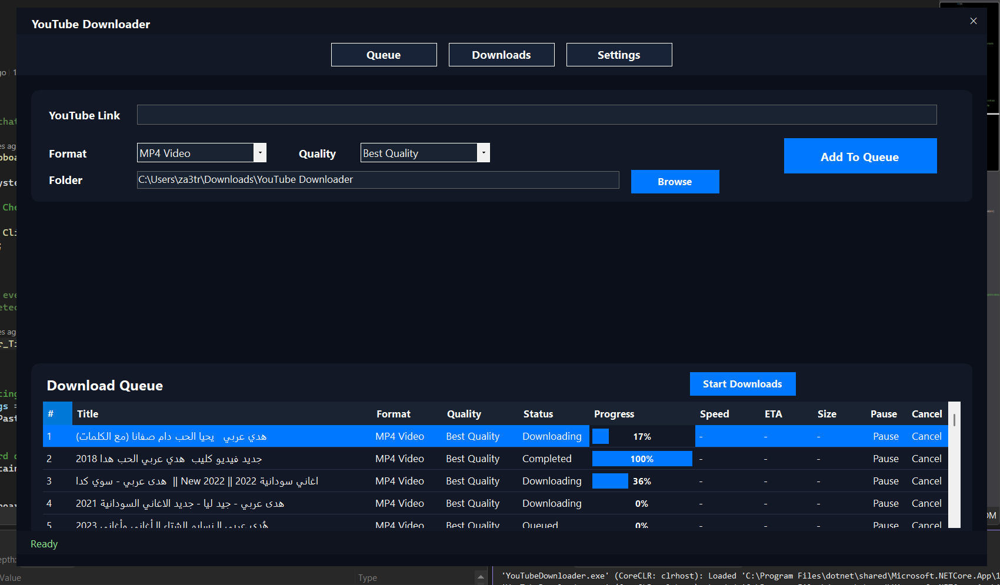
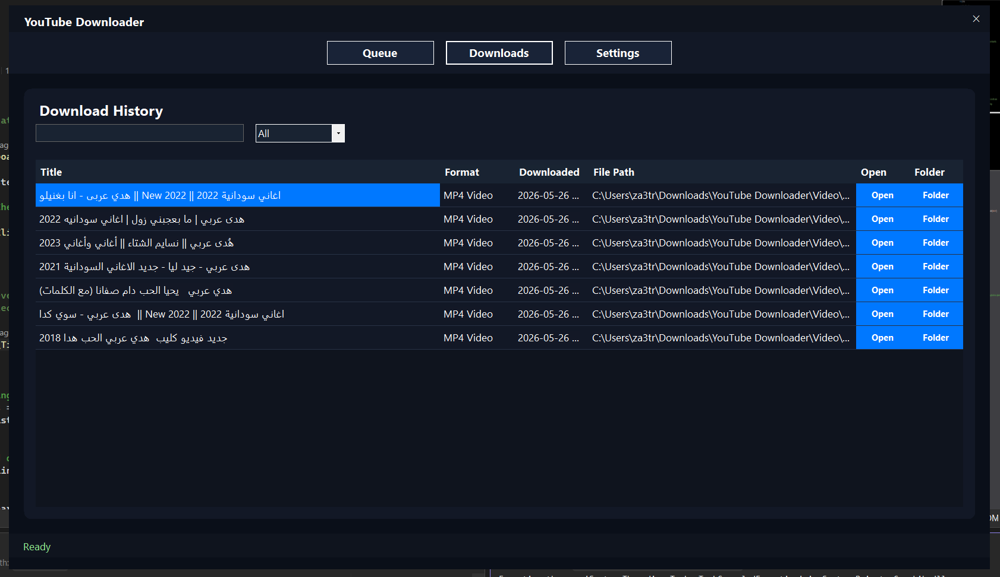
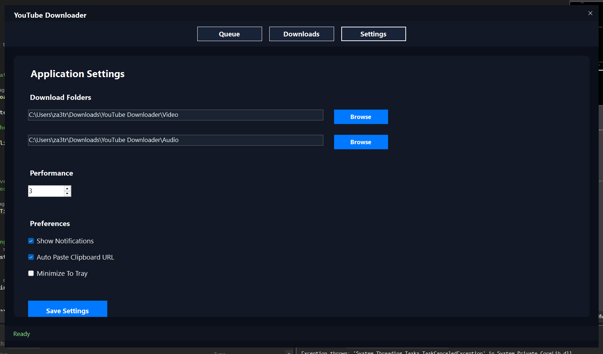

# 🎬 YouTube Downloader

A modern and feature-rich desktop YouTube downloader built with **.NET 9 WinForms**, featuring a clean custom UI, playlist support, download queue management, history tracking, and advanced settings.

---

## ✨ Features

### 🎥 Video & Audio Downloads
- Download YouTube videos in:
  - MP4 Video
  - MP3 Audio
- Multiple quality options:
  - Best Quality
  - 1080p
  - 720p
  - 480p

---

### 📂 Playlist Support
- Download entire YouTube playlists
- Automatically queues all videos
- Batch processing support

---

### 📋 Download Queue Manager
- Multi-download queue system
- Pause / Resume downloads
- Cancel downloads
- Real-time:
  - Progress
  - Download speed
  - ETA
  - File size
  - Status tracking

---

### 🖼 Video Preview
- Live thumbnail preview
- Video metadata display:
  - Title
  - Author
  - Duration
  - Publish date
- Playlist preview support

---

### 📜 Download History
- SQLite-powered history tracking
- Search functionality
- MP3 / MP4 filtering
- Quick:
  - Open file
  - Open containing folder

---

### ⚙️ Settings System
- Custom audio/video download folders
- Concurrent download configuration
- Clipboard auto-paste detection
- Notification preferences
- Minimize-to-tray support

---

### 📋 Smart Clipboard Detection
Automatically detects copied YouTube URLs and pastes them into the application.

Supported:
- youtube.com
- youtu.be

---

### 🎨 Modern UI
Custom-designed WinForms interface featuring:
- Borderless window
- Rounded panels
- Dark theme
- Responsive layout
- Styled DataGridViews
- Smooth UX

---

## 🏗 Architecture

The project follows a modular partial-class architecture for maintainability and scalability.

### Structure

```text
YouTubeDownloader/
│
├── Controls/
│   ├── RoundedPanel.cs
│   └── DataGridViewProgressColumn.cs
│
├── Data/
│   ├── AppDbContext.cs
│   └── Migrations/
│
├── Forms/
│   └── MainForm/
│       ├── MainForm.cs
│       ├── MainForm.Fields.cs
│       ├── MainForm.Layout.cs
│       ├── MainForm.Queue.cs
│       ├── MainForm.Preview.cs
│       ├── MainForm.History.cs
│       ├── MainForm.Settings.cs
│       └── MainForm.Clipboard.cs
│
├── Helpers/
│
├── Models/
│   ├── DownloadItem.cs
│   ├── DownloadHistory.cs
│   └── AppSettings.cs
│
├── Services/
│   ├── YouTubeService.cs
│   ├── DownloadService.cs
│   └── SettingsService.cs
│
└── Program.cs
```

---

## 🛠 Technologies Used

### Backend
- .NET 9
- C#
- WinForms
- Entity Framework Core
- SQLite

### Libraries
- YoutubeExplode
- FFmpeg
- Microsoft.Data.Sqlite

---

## 🚀 Getting Started

## 1. Clone Repository

```bash
git clone https://github.com/YOUR_USERNAME/YouTubeDownloader.git
```

---

## 2. Open Solution

Open:

```text
YouTubeDownloader.sln
```

Using:
- Visual Studio 2022 / 2026

---

## 3. Install Dependencies

Restore NuGet packages:

```bash
dotnet restore
```

---

## 4. Apply Database Migration

```bash
dotnet ef database update
```

---

## 5. Run Application

Press:

```text
F5
```

or:

```bash
dotnet run
```

---

## 📦 Requirements

- Windows 10 / 11
- .NET 9 SDK
- FFmpeg installed and accessible in PATH

---

## 🔧 Planned Features

- Theme customization
- Download scheduler
- Drag & drop URLs
- System tray integration
- Auto-update system
- Multi-language support
- Download statistics
- Plugin architecture
- TikTok / Vimeo support
- Browser extension integration

---

## 📸 Screenshots

### Main Queue

### Download History


### Settings Panel


---

## ⚠️ Disclaimer

This project is intended for educational and personal use only.

Users are responsible for complying with YouTube’s Terms of Service and copyright laws.

---

## 👨‍💻 Author

Developed by **Cyber Geeks**

---

## 📄 License

This project is licensed under the MIT License.
